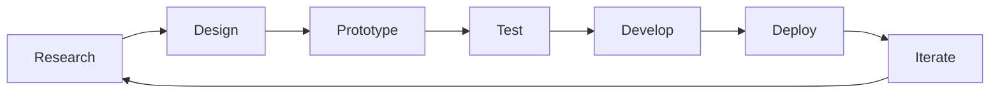

<div align="center">
  
# 👋 Hi, I'm Siddhant Bilange

### UX Designer · Visual Designer · Frontend Developer

[](https://www.siddhantbilange.dev)
[](https://linkedin.com/in/siddhant-bilange)
[](mailto:siddhantbilange@gmail.com)

</div>

---

## 🚀 About Me

I'm a **designer who codes** and a **developer who designs** — bridging the gap between elegant UX design and robust frontend development. With **1+ years of experience** and a passion for creating seamless digital experiences, I deliver pixel-perfect, accessible, and performant web applications.

```javascript
const siddhant = {
    role: ["UX Designer", "Visual Designer", "Frontend Developer"],
    currentStatus: "Available for new opportunities",
    projectsDelivered: "5+",
    clientSatisfaction: "100%",
    philosophy: "Good design is invisible—it just works."
};
```

<div align="center">

### 💼 Professional Stats


</div>

---

## 🎨 Design Expertise

### UX Design
```
🔍 User Research  •  🗺️ User Flows  •  📐 Wireframing
🎭 Prototyping  •  🧪 Usability Testing  •  ♿ Accessibility
📚 Design Systems
```

**Philosophy**: *I figure out what users need by watching how they work, asking the right questions, and testing assumptions early. Then I design solutions that reduce friction and help people get things done faster.*

---

## 💻 Technical Stack

<div align="center">

### Frontend Development


### Design Tools


### Development Tools


### AI-Powered Workflow


</div>

---

## 🎯 What I Do

<table>
<tr>
<td width="50%" >

### 🎨 UX/UI Design
- User research & persona development
- Information architecture
- Interactive prototyping
- Design systems & component libraries
- Usability testing & iteration

</td>
<td width="50%">

### 💻 Frontend Development
- Responsive web applications
- React.js & modern JavaScript
- Performance optimization
- Accessibility (WCAG 2.1)
- SEO best practices

</td>
</tr>
</table>

---

## 🏆 Featured Projects

### 🏢 LA Concierge Dashboard
> Luxury concierge service management platform
- **Stack**: React.js, Typescript, Tailwind CSS, UX Design
- **Features**: Real-time booking, analytics dashboard, luxury service management
- **Impact**: Streamlined operations for high-end concierge services

### 💰 GB Finance Platform
> Financial dashboard with comprehensive analytics
- **Stack**: HTML, SCSS(Advanced CSS), PHP, MYSQL
- **Features**: Financial tracking, data visualization, user management

### 📱 Directory App
> Modern directory and listing platform
- **Stack**: User research, Wireframing, Prototyping
- **Features**: Search functionality, categorization, mobile-first approach

### 🎵 ConnectFM
> Music streaming and discovery platform
- **Stack**: User research, Wireframing, Prototyping, Usability Testing
- **Features**: Music player, discovery algorithms, social features

### 📈 Stock Market Analysis
> Real-time stock market analytics tool
- **Stack**: High-Fidelity Prototypes
- **Features**: Real-time data, charts, analysis tools

---

## 📊 GitHub Stats

<div align="center">


</div>

---

## 🎓 My Approach

<div align="center">



</div>

> **"Good design is invisible—it just works. If it doesn't work in the browser, it doesn't matter."**

---

## 🤝 Let's Collaborate

I'm always interested in:
- 🎨 Challenging UX/UI design projects
- 💻 Frontend development opportunities
- 🚀 Innovative product design
- 🤝 Open-source contributions
- 📚 Knowledge sharing & mentorship

---

## 📫 Get In Touch

<div align="center">

**Open for opportunities and collaborations!**

[](https://www.siddhantbilange.dev)
[](mailto:siddhantbilange@gmail.com)
[](https://linkedin.com/in/siddhant-bilange)
[](https://github.com/siddhantbilange)

</div>

---

<div align="center">

### ⚡ Fun Fact

I leverage **GitHub Copilot** and **Cursor AI** to supercharge my development workflow, allowing me to focus more on design thinking and less on boilerplate code!

---

💙 **Thanks for visiting!** Don't forget to ⭐ repositories you find interesting!


</div>
